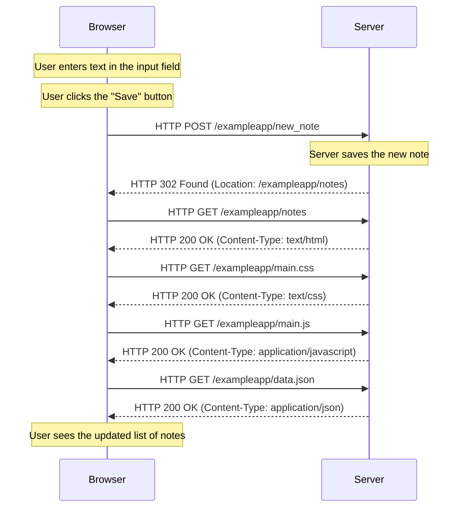

```mermaid
sequenceDiagram
    participant Browser
    participant Server

    Note over Browser: User enters text in the input field
    Note over Browser: User clicks the "Save" button
    Browser->>Server: HTTP POST /exampleapp/new_note
    Note over Server: Server saves the new note
    Server-->>Browser: HTTP 302 Found (Location: /exampleapp/notes)
    Browser->>Server: HTTP GET /exampleapp/notes
    Server-->>Browser: HTTP 200 OK (Content-Type: text/html)
    Browser->>Server: HTTP GET /exampleapp/main.css
    Server-->>Browser: HTTP 200 OK (Content-Type: text/css)
    Browser->>Server: HTTP GET /exampleapp/main.js
    Server-->>Browser: HTTP 200 OK (Content-Type: application/javascript)
    Browser->>Server: HTTP GET /exampleapp/data.json
    Server-->>Browser: HTTP 200 OK (Content-Type: application/json)
    Note over Browser: User sees the updated list of notes
```