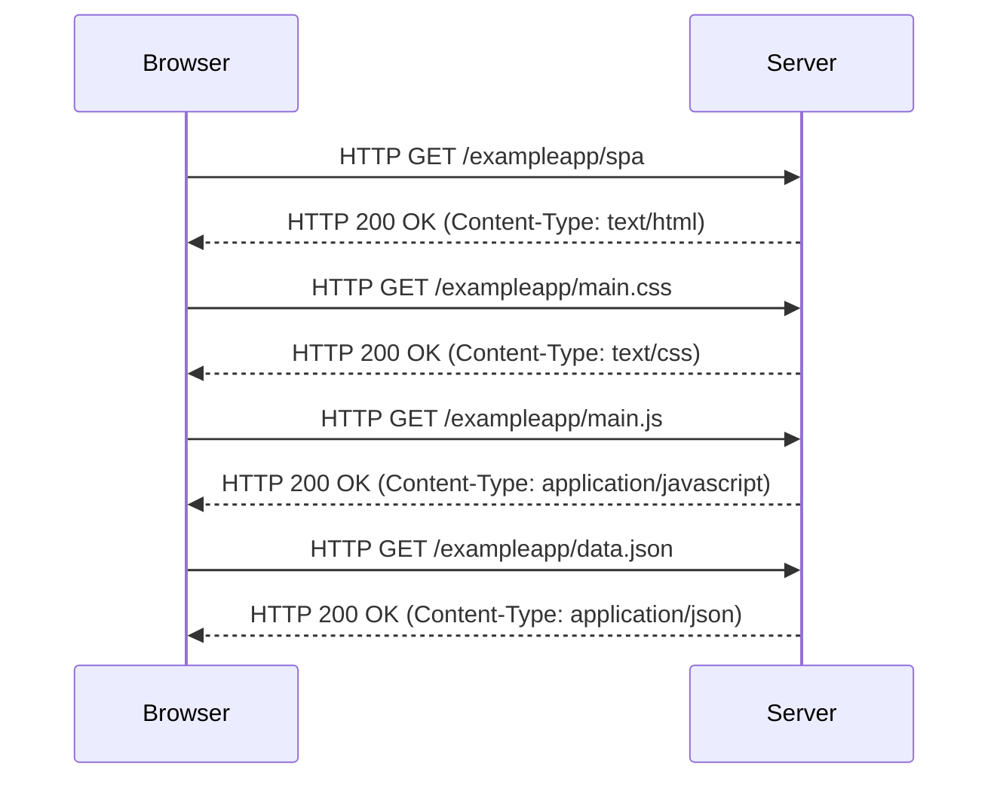

```mermaid
sequenceDiagram
    participant Browser
    participant Server

    Browser->>Server: HTTP GET /exampleapp/spa
    Server-->>Browser: HTTP 200 OK (Content-Type: text/html)
    Browser->>Server: HTTP GET /exampleapp/main.css
    Server-->>Browser: HTTP 200 OK (Content-Type: text/css)
    Browser->>Server: HTTP GET /exampleapp/main.js
    Server-->>Browser: HTTP 200 OK (Content-Type: application/javascript)
    Browser->>Server: HTTP GET /exampleapp/data.json
    Server-->>Browser: HTTP 200 OK (Content-Type: application/json)

```