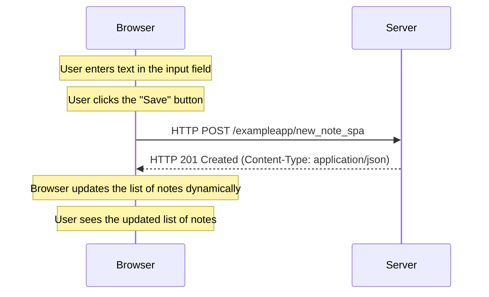

```mermaid
sequenceDiagram
    participant Browser
    participant Server

    Note over Browser: User enters text in the input field
    Note over Browser: User clicks the "Save" button

    Browser->>Server: HTTP POST /exampleapp/new_note_spa
    Server-->>Browser: HTTP 201 Created (Content-Type: application/json)

    Note over Browser: Browser updates the list of notes dynamically
    Note over Browser: User sees the updated list of notes
```